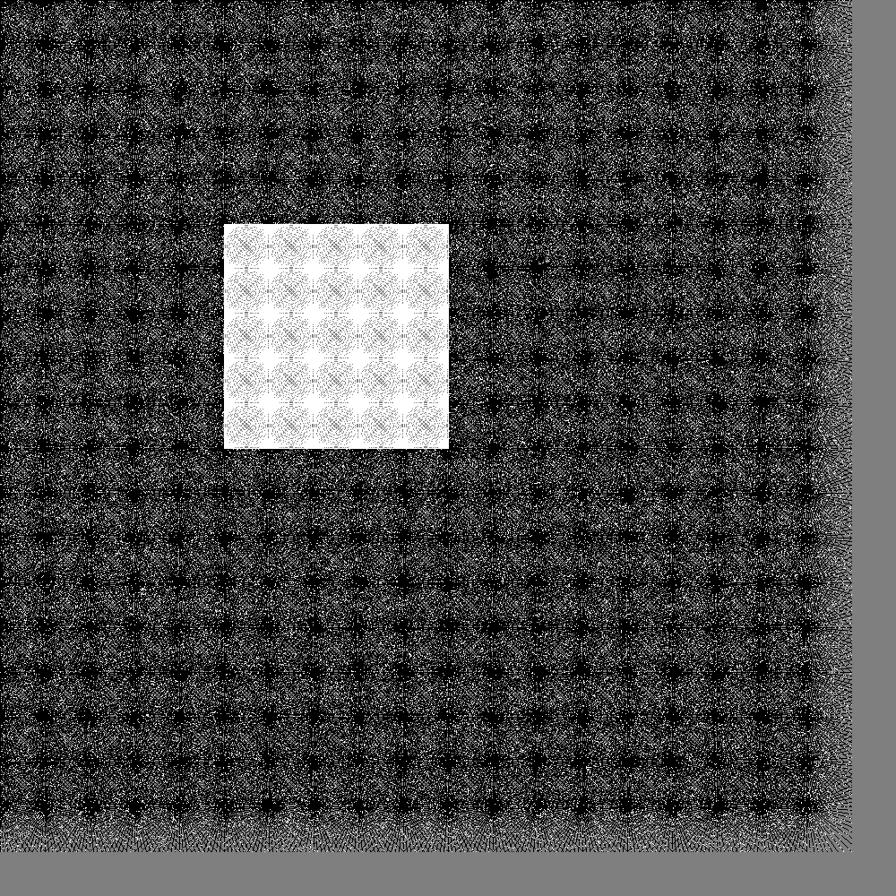

# CS 302 - Bonus Project - Robotic Navigation
Date: 12/19/18 | Author: Matt Davis | [Assignment](./cs302-bonus-assignment.pdf)

---
Most of the code can be found in the [Robot](./Robot.h) class. The test
driver is in [test.cpp](./test.cpp). Build with `make`.

---

The purpose of this assignment was to get a chance to put
what we'd learned this semester to the test in a non-trivial application.
We were to simulate 2d robotic navigation using an Occupancy Grid Map.
Our robot was supposed to be able to detect and navigate around a large
square obstacle.

My attempt at completing this assignment wasn't nearly as successful as
I would have liked. It was still fun, though! Since I didn't do very well
-- I don't think -- I'll use this space to record some thoughts on what I
thought went well and where I came up short.

### The Data Structure
- [ArrayOccupancyGrid](./ArrayOccupancyGrid.h)
- [OccupancyGridCell](./OccupancyGridCell.h)

I chose to represent the grid via a 2d array.
I actually used nested `std::vector`s, but the effect was the same. I
think this was a logical choice, but I got the feeling the assignment
wanted me to choose something else. I'm not even sure what. A graph of
some sort? I don't even know what else I could have used. Nested
arrays seemed like the obvious way to go.

### Raycasting
- [Raytracer](./Raytracer.h)

After I got the structure set up, I spent A LOT of time trying to figure out
raycasting. The images shown in the assignment didn't make sense to me.
If a ray is cast directly east, then it's trivial to know that it will
only pass through cells on the same row as the robot. However, once
the ray is traveling at an angle -- say a 30 degree offset from east --
it's much more difficult to know which cells will get readings.

I chose to implement the simplest algorithm I could think of. It consists
of two methods: `getRiseRun` and `trace`.

`getRiseRun`s job is to take an angle theta and generate the slope of
that angle. But there are some caveats. I wanted either the rise or the
run to be equal to 1, so I needed to do some scaling. I also had to handle
the fact that angles are not directional. For example theta 45 and
theta 225 return the same slope. But they are fundamentally different! The
former represents a ray traveling upward and rightward equally and the latter
is the exact opposite. For me, the solution was to flip the sign of both
rise and run if the theta was in quadrant 2 or 3 of the unit circle.

`trace` is the heart of the algorithm. It calls `getRiseRun` to find how
much a single step will increment the ray along both axes. It then performs
50 steps. (The rays are only allowed to travel 50 cells. More on this later.)
Along each step, the total distance traveled -- step size * num steps -- is
intentionally truncated so each step results in two clean ints to be used
as x and y coordinates on the grid.

As noted above, this took a lot of time. I'm pretty disappointed that that
much effort can be boiled down to two or three short paragraphs. But if you
like crushing disappointment, keep reading! There's much more to come.

### The Math
This is what killed me. I spent a very long time looking through the math
used in the examples and still don't understand it. Dr. Alexis or TAs,
if you're reading this, I'd still like to know what I was doing wrong.

### The Map
I wrote a pretty cool method that would take the entire data structure
and output a .pgm image to help visualize what the robot saw. The entire
time I was working on this project, I thought I could use this method to
output incremental images that would illustrate how the bot built confidence
in its assessment of its surroundings over time. Imagine my disappointment
when this is what came out.

What the hell is that? It's so lame!

I hadn't realized how tiny the robot is in comparison to the map and the
obstacle. Did I do something wrong here? I really don't think so. The
robot's rays can only travel 50 cells, and that's assuming they don't
perceive some obstacle along the way (which they ALWAYS do). Even if they
traveled the full 50 every time, the robot never gets within 50 cells of
the obstacle. Ever. With the assignments constraints as I understand them,
it was never possible for the robot to actually detect anything. And the
rays are so skinny! Even with the 15 degree offsets, I expected there to
be some overlap, but the overlap was negligible. Nearly every cell on the
map that was measured was only measured once.

Maybe this was some sort of illustration of the huge task that true mapping
bots are up against? If it's this hard for a tiny 2d simulation, imagine what
quadcopters mapping tunnels are doing.

Whatever the reason, it really sucked seeing that map. So I wanted to amp
it up a bit. I wrote some temporary code to place the bot at evenly-spaced
increments along the map, then spin 360 degrees and scan. Here's the result:

This looks kind of cool. It's closer to what I'd imagined at least. But
it is VERY far from what the assignment laid out. This image illustrates
a total of over 25,000 rays cast. I even turned off the instruction to
stop tracing a ray if it hits something -- the only limit was the 50 cell
range. And still, there are fairly obvious holes in the data.

### Navigation
Didn't even get to this step.

### Summary
This is not a successful attempt at the assignment. But I'm still sort
of proud of it. It was an honest effort, at least. I'd like to see what
a good grade on this assignment looks like. Did the other students actually
generate maps that looked complete? Did their bots work?

Regardless, thanks for the opportunity.